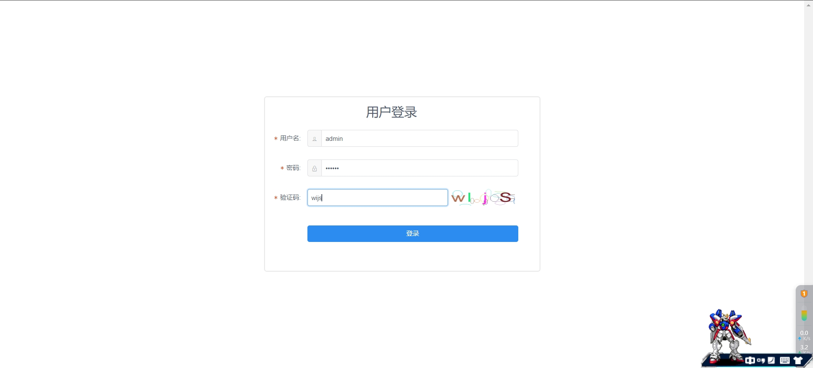
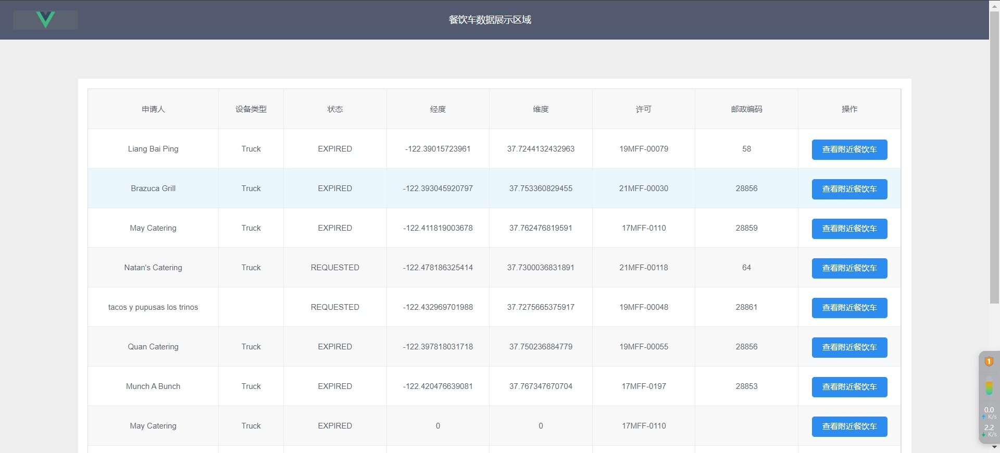
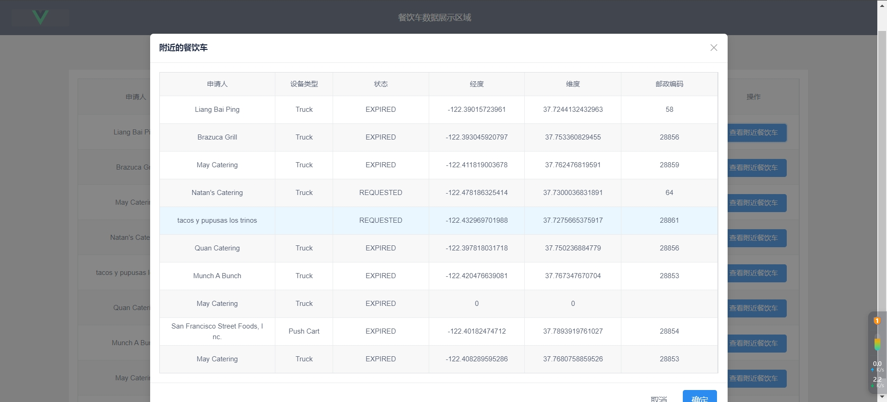
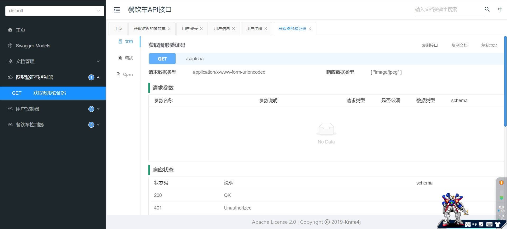

### 餐饮车项目文档
#### 1.后台环境(本项目可以通过简单的单体架构满足需求)

~~~shell
第一.首先安装JDK8环境
第二.安装MySQL和Redis环境
~~~

#### 2.后台项目架构说明
~~~shell
2.1采用的SpringBoot、MySQL、Redis、MybatisPlus、JJWT、Knife4j等等实现简单的前后端分离服务架构。
2.2采用Redis geo获取附近的餐饮车信息。
2.3采用ThreadLocal保存用户信息。
2.4使用Hutool All生成图形验证码。
2.5并采用JSR303作为后端校验前端产过来的参数(同时也做了分组校验功能)。
2.6采用Jwwt生成无状态的token用来用户的身份校验。
2.7开发相应简单的登录、注册、图形验证码、餐饮车分页、餐饮基本信息、餐饮车上传等api接口
2.8同时添加一个拦截器，用来校验前端前端传过来的token值。
2.9加入了统一结果返回，以及全局异常处理等功能。
~~~

#### 3.启动并访问后台项目接口

~~~shell
3.1 拉取项目
git clone https://github.com/znlccy/zccar.git

3.2 可以直接使用idea运行该后端项目
首先要配置application.yml中对应的MySQL数据源和Redis数据源保证项目能正常启动

3.3 可以通过maven一些命令
mvn clean
mvn package xxx (打包命令)
mvn springboot:run

3.4 通过浏览器输入http://localhsot:8888/doc.html访问api接口
同时可以用来测试接口
~~~

#### 4.前端项目

~~~shell
4.1 创建前端项目
vue create zccar-ui

4.2 下载依赖包
cd zccar-ui
npm install

4.3 配置项目
在zccar-ui/src/utils/request.js
配置BaseURL对应是你启动后端项目的pi地址和端口

4.4 运行项目
npm run serve

4.5 构建项目
npm build
~~~

#### 5.部署前后台项目
~~~shell
5.1可以通过jenkins工具编写对应的脚本实现自动化部署
5.2也可以自己通过打包上传的方式部署
~~~

#### 6.项目截图

